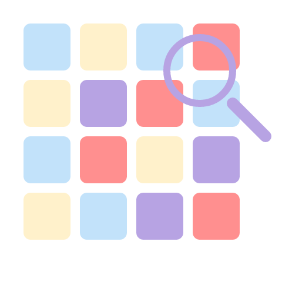

# Zigzag — a word game

A word search puzzle. On each level, you need to find hidden words containing a specific letter within a grid of letters.

You can play [here](https://alyona-belova.github.io/word_search_game_english/).



## Features

- Each level randomly selects a theme letter and matching words
- Words can twist and change direction. They are placed using a depth-first search (DFS) algorithm with a preference for straight-line movement
- Finding 3 bonus words unlocks a hint that highlights one of the remaining words
- Found words are displayed as colored SVG lines over the grid
- The dictionary contains around 7,000 carefully selected words
- Game state is saved to localStorage

## Technologies

| Layer | Technology |
|---|---|
| Language | TypeScript |
| Rendering | Vanilla DOM + SVG overlays |
| Styling | CSS with custom properties, clamp(), grid layout |
| Storage | localStorage |

## Getting Started

**Requirements:** Node.js (for TypeScript compiler)
```bash
# Install dependencies
npm install

# Run locally
npm run dev

# Build for production
npm run build